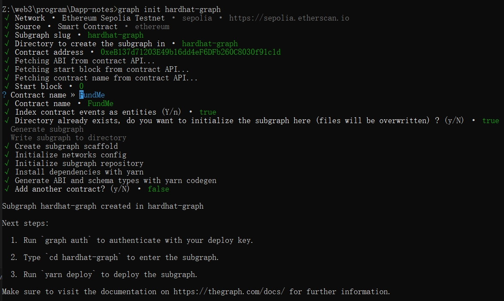
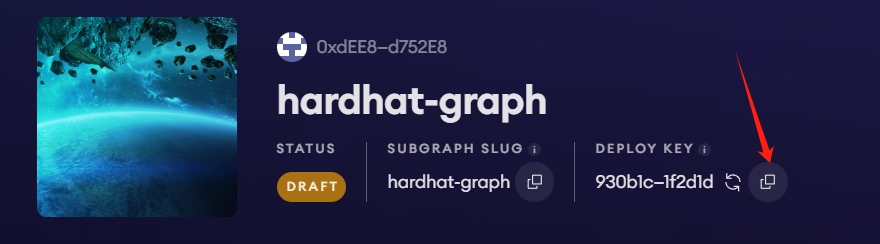
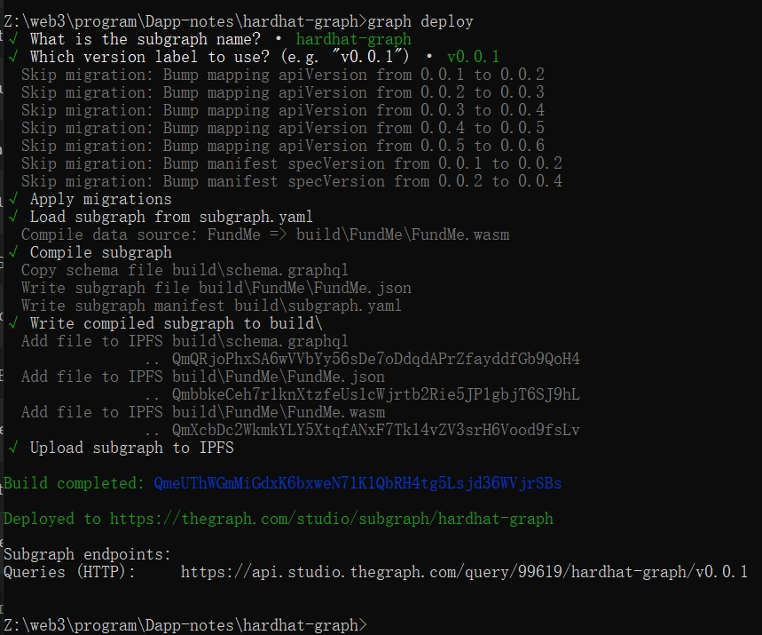
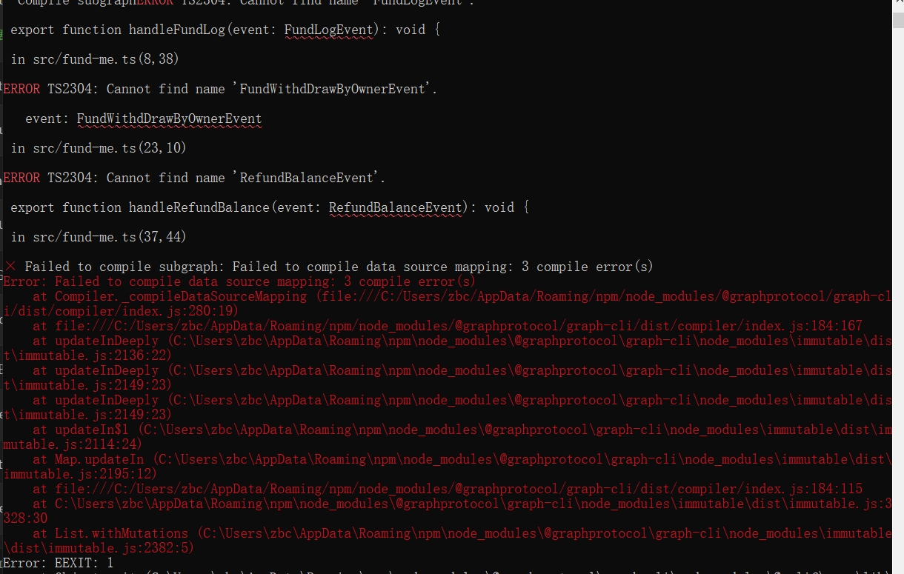

# Thegraph 介绍

它去统计某个合约，从开始部署到现在的所有的事件，可以通过Graphql语言去查询，通过将代码部署到它的服务器上就可以了，不需要单独去维护一个服务器

## thegraph 和 Dune 的区别


[thegraph.com](https://thegraph.com/docs/zh/)  

[graphql.cn](https://graphql.cn/learn/)

# 环境安装

全局安装
> npm install -g @graphprotocol/graph-cli  
> graph init hardhat-graph  



# 授权和部署

   首先获取你的 `<DEPLOY KEY>`，在你的 subgraph 项目主页可以找到：
   <center>
   
   </center>

   - 授权

     ```bash
     graph auth --studio <DEPLOY KEY>

     #注意需要按截图所示点击copy key按钮，并替换<DEPLOY KEY> , 不要直接copy 官网右侧的代码，因为key不全
     ```

     若使用 Hosted Service，则初始化命令如下：

     ```bash
     graph auth --product hosted-service <ACCESS_TOKEN>
     ```

   - 进入 subgraph 的本地目录

     ```bash
     cd ./<SUBGRAPH_NAME>
     ```

   - BUILD SUBGRAPH

     ```bash
     graph codegen && graph build
     ```

   - DEPLOY SUBGRAPH

     ```bash
     graph deploy --studio <SUBGRAPH_NAME>
     ```

     若使用 Hosted Service，则初始化命令如下：

     ```bash
     graph deploy --product hosted-service <GITHUB_USER>/<SUBGRAPH NAME>
     ```

     - 这里必须输入 `Version Label` , 比如`0.0.1`， 否则会报错提示 `You must provide a version label.`

<center></center>

# 部署异常处理

  如果出现下面这样的异常，找不到 generated 文件中的某个事件，先注释 .gitignore中的 generated/
  <center></center>

# 部署后地址

https://api.studio.thegraph.com/query/99619/hardhat-graph/v0.0.1

# 学习资料

[「Rebase 大学」区块链数据缓存框架 TheGraph](https://www.bilibili.com/video/BV12y4y177ph/?spm_id_from=333.999.0.0&vd_source=35e66fb56cf7f295e7d1d550f772c64d)  
https://www.bilibili.com/video/BV1ZK4y137Ce/?spm_id_from=333.788.recommend_more_video.1&vd_source=35e66fb56cf7f295e7d1d550f772c64d  
[TheGraph监听合约实战](https://www.bilibili.com/video/BV1yCaUeSE8y?spm_id_from=333.788.videopod.sections&vd_source=35e66fb56cf7f295e7d1d550f772c64d)  
https://learnblockchain.cn/article/2566#2.subgraph%20%E6%B8%85%E5%8D%95%EF%BC%88%20yaml%20%E9%85%8D%E7%BD%AE%EF%BC%89
