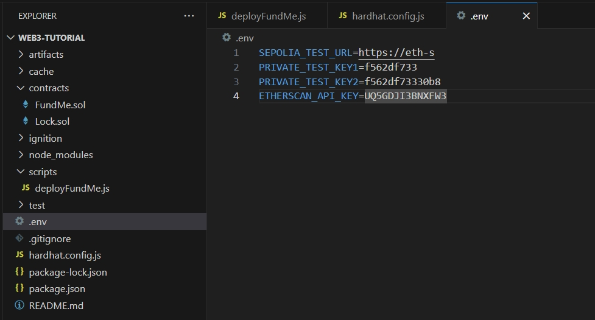
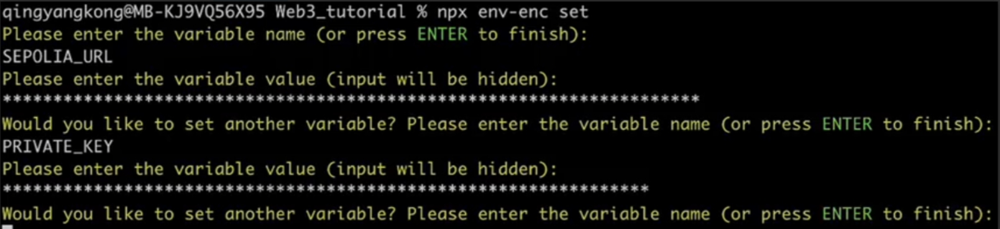
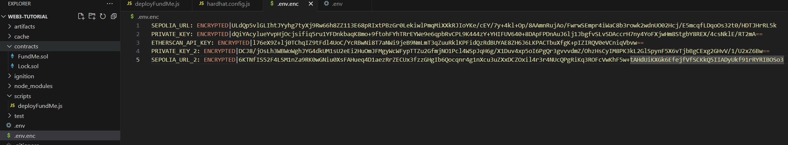

[Hardhat's tutorial 官网](https://hardhat.org/tutorial)

# Creat Hardhat Project

> mkdir hardhat-project  
> cd hardhat-project  
> npm init -y  
> npm install hardhat --save-dev  
> npx hardhat init  

> 安装第三方合约  
> npm install @chainlink/contracts --save-dev  
> npm install @openzeppelin/contracts —save-dev  

> 编译contracts下面的所有合约  
> npx hardhat compile  

# 网络&私钥配置

如果要部署真实的测试网，通过第三方服务商拿到免费的url Elchemy,Infura,QuickNode

第三方平台提供测试网络url

[https://dashboard.alchemy.com/apps/71bocmbcvuws4jpm/networks](https://dashboard.alchemy.com/apps/71bocmbcvuws4jpm/networks)

## dotenv

> npm install --save-dev dotenv

hardhat.config.js 文件添加 
> require("dotenv").config() 或者
> require("dotenv").config({path: '../.env'})
> 
> const SEPOLIA_TEST_URL = process.env.SEPOLIA_TEST_URL
> //钱包私钥
> const PRIVATE_TEST_KEY1 = process.env.PRIVATE_TEST_KEY1


## env-enc

npm install --save-dev @chainlink/env-enc
设置密码
npx env-enc set-pw
922953zbc
给变量名加密
npx env-enc set
查看变量信息
npx evn-enc view

hardhat.config.js 文件添加 
> require("@chainlink/env-enc").config();



# 测试框架
hardhat-toolbox 已经包含了 mocha 和 chai，不需要额外安装
https://mochajs.org/
[Chai](https://www.chaijs.com/)

## Hardhat Deploy

npm install --save-dev @nomicfoundation/hardhat-ethers ethers hardhat-deploy hardhat-deploy-ethers

-D：--save-dev

require("@nomicfoundation/hardhat-ethers");

require("hardhat-deploy");

require("hardhat-deploy-ethers");
# Gas消耗查询

npm install --save-dev hardhat-gas-reporter

执行：npx hardhat test

可以配置是否展示消耗信息
gasReporter: {
    enabled: false
  }

# ABI导出

```
abiExporter: {
    path: './abi', // ABI导出目录的路径（相对于Hardhat根目录）
    runOnCompile: true, // 是否在编译时自动导出ABI
    clear: true, // 是否在编译时清除旧的ABI文件
    flat: false, // 是否将输出目录扁平化（可能会造成命名冲突）
    only: [], // 选择包含的合约数组
    except: [], // 排除的合约数组
    spacing: 2, // 格式化输出的缩进空格数
    pretty: true // 是否使用接口风格的格式化输出
},
```

# 覆盖率查询

查看测试代码的覆盖率 npx hardhat coverage