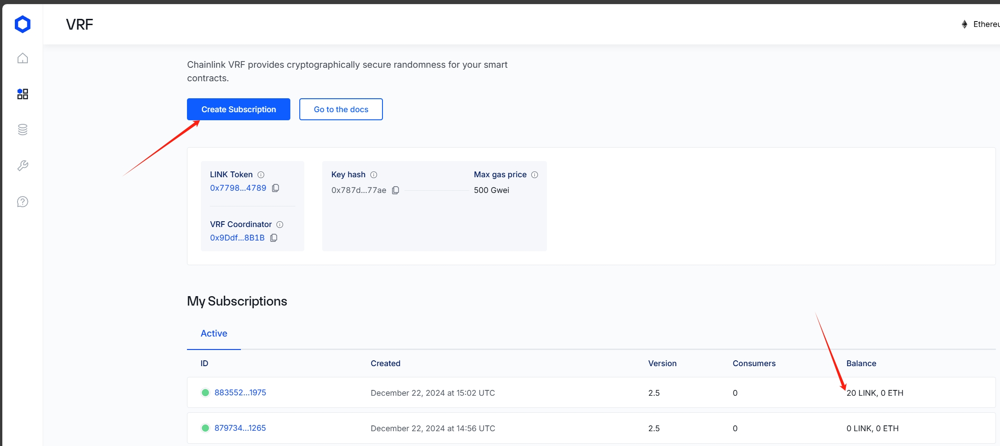
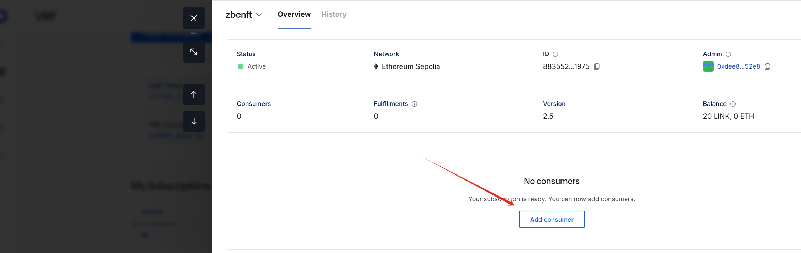
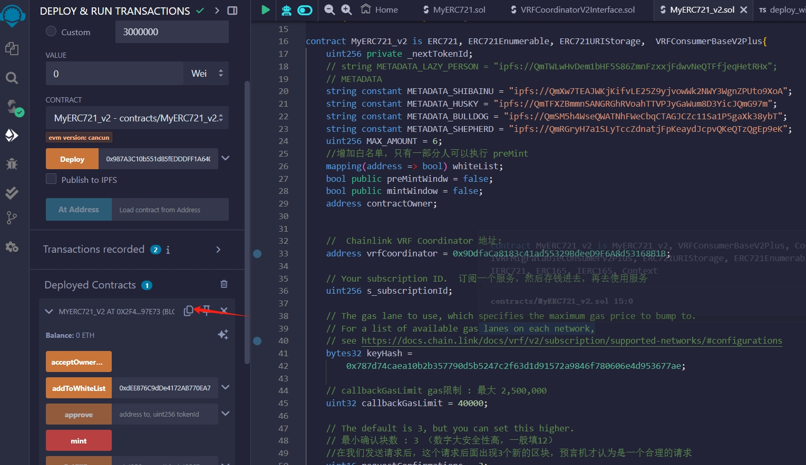

随机数的生成方式有两种，链上（哈希函数）和链下（chainlink 预言机）

# 链上哈希函数

我们可以将一些链上的全局变量作为种子，利用`keccak256()`哈希函数来获取伪随机数。这是因为哈希函数具有灵敏性和均一性，可以得到“看似”随机的结果。下面的`getRandomOnchain()`函数利用全局变量`block.timestamp`，`msg.sender`和`blockhash(block.number-1)`作为种子来获取随机数：

```
    /** 
    * 链上伪随机数生成
    * 利用keccak256()打包一些链上的全局变量/自定义变量
    * 返回时转换成uint256类型
    */
    function getRandomOnchain() public view returns(uint256){
        // remix运行blockhash会报错
        bytes32 randomBytes = keccak256(abi.encodePacked(block.timestamp, msg.sender, blockhash(block.number-1)));
        
        return uint256(randomBytes);
    }
```

**注意:**，这个方法并不安全：

- 首先，`block.timestamp`，`msg.sender`和`blockhash(block.number-1)`这些变量都是公开的，使用者可以预测出用这些种子生成出的随机数，并挑出他们想要的随机数执行合约。
- 其次，矿工可以操纵`blockhash`和`block.timestamp`，使得生成的随机数符合他的利益。

尽管如此，由于这种方法是最便捷的链上随机数生成方法，大量项目方依靠它来生成不安全的随机数，包括知名的项目`meebits`，`loots`等。当然，这些项目也无一例外的被[攻击](https://forum.openzeppelin.com/t/understanding-the-meebits-exploit/8281)了：攻击者可以铸造任何他们想要的稀有`NFT`，而非随机抽取。

# 链下随机数生成

[Getting Started with Chainlink VRF V2.5 | Chainlink Documentation](https://docs.chain.link/vrf/v2-5/getting-started)

[Chainlink Faucets - link水龙头](https://faucets.chain.link/)

[VRF | Subscription Managemen 订阅](https://vrf.chain.link/)

我们可以在链下生成随机数，然后通过预言机把随机数上传到链上。`Chainlink`提供`VRF`（可验证随机函数）服务，链上开发者可以支付`LINK`代币来获取随机数。 `Chainlink VRF`有两个版本，第二个版本需要官网注册并预付费，比第一个版本多许多操作，需要花费更多的gas，但取消订阅后可以拿回剩余的Link，这里介绍第二个版本`Chainlink VRF V2`。

```
		/**
        * 向VRF合约申请随机数
        */

       requestId = s_vrfCoordinator.requestRandomWords(

            VRFV2PlusClient.RandomWordsRequest({

                keyHash: keyHash,

                subId: s_subscriptionId,

                requestConfirmations: requestConfirmations,

                callbackGasLimit: callbackGasLimit,

                numWords: numWords,

                // Set nativePayment to true to pay for VRF requests with Sepolia ETH instead of LINK

                extraArgs: VRFV2PlusClient._argsToBytes(VRFV2PlusClient.ExtraArgsV1({nativePayment: false}))

            })

        );
```

# 合约和VRF关联

创建订阅ID，然后添加到合约中


开始把合约地址添加到VRF的consumer中



复制合约地址添加到 consumer中，然后合约就可以请求VRF得到 requestId


# 学习资料

[NFT 智能合约教程：白名单，随机铸造，动态更新_哔哩哔哩_bilibili](https://www.bilibili.com/video/BV1T24y167KT/?spm_id_from=333.788.recommend_more_video.1&vd_source=35e66fb56cf7f295e7d1d550f772c64d)


